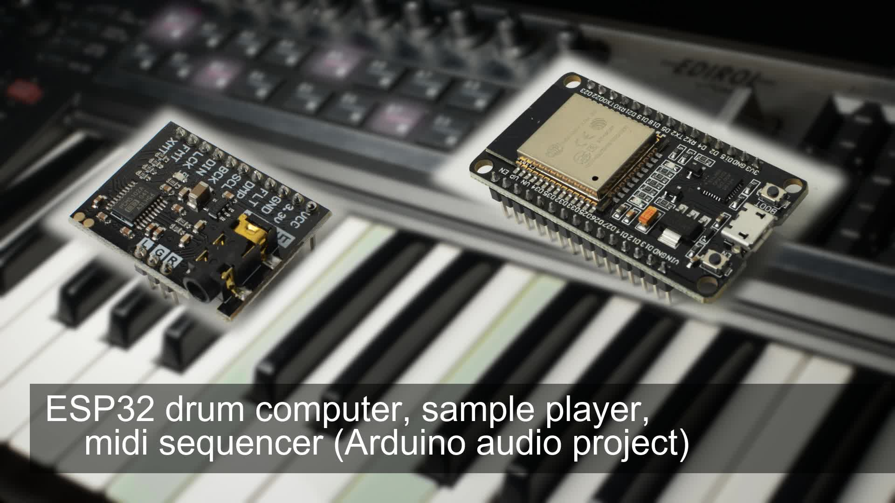

<h1 align="center">esp32_drum_computer</h1>
<h3 align="center">ESP32 drum computer / sample player / midi sequencer (Arduino audio project)</h3>  

 
   
  <a href="video https://youtu.be/vvA7vfouk84">link to the video</a>

[![Badge License]][License]
[![Preview Thumbnail]][Preview]

---

- video presentation of the initial state of this project https://youtu.be/vvA7vfouk84
- little quick start guide to get started with arduino synthesizer / music projects: https://youtu.be/ZNxGCB-d68g

Supported versions of board library
---
- ESP32 version 1.0.6 from https://github.com/espressif/arduino-esp32/releases/tag/1.0.6
- ESP32 version 2.0.2 from https://github.com/espressif/arduino-esp32/releases/tag/2.0.2
Please be aware that other versions might be not supported.

The project has been tested on the ESP32 Audio Kit (with ES8388 audio codec)
The project has been tested on the ESP32 Audio Kit (with AC101 audio codec)

After uploading the firmware you should hear the metronome.
The software will be automatically in recoding mode.
Please do not forget to upload the data using the LittleFS data upload.
The files will be mapped to the keys automatically. The samples are stored in the ESP32 flash memory.
SD card is not supported yet.

Questions, Ideas, Comments
---
Please feel free to use the discussion area of this project: https://github.com/marcel-licence/esp32_drum_computer/discussions

Derived projects 
---
@ErichHeinemann made a Volca Beats PCM MOD with display and additional controls: https://github.com/ErichHeinemann/ESP32-Audio-Tests-ML
Video of the Volca Beats PCM MOD https://youtu.be/XIrn2-dZn1U (2) https://youtu.be/J7IOvEoxopA (3) https://youtu.be/R3fIEp8z8aU
